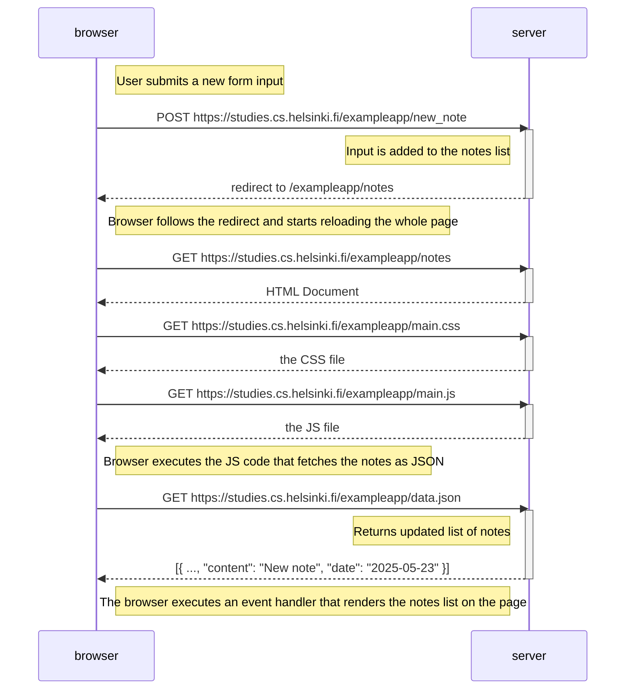

```mermaid

sequenceDiagram
    participant browser
    participant server

    Note right of browser: User submits a new form input

    browser->>server: POST https://studies.cs.helsinki.fi/exampleapp/new_note
    activate server
    Note left of server: Input is added to the notes list
    server-->>browser: redirect to /exampleapp/notes
    deactivate server

    Note right of browser: Browser follows the redirect and starts reloading the whole page

    browser->>server: GET https://studies.cs.helsinki.fi/exampleapp/notes
    activate server
    server-->>browser: HTML Document
    deactivate server

    browser->>server: GET https://studies.cs.helsinki.fi/exampleapp/main.css
    activate server
    server-->>browser: the CSS file
    deactivate server
    
    browser->>server: GET https://studies.cs.helsinki.fi/exampleapp/main.js
    activate server
    server-->>browser: the JS file
    deactivate server

    Note right of browser: Browser executes the JS code that fetches the notes as JSON

    browser->>server: GET https://studies.cs.helsinki.fi/exampleapp/data.json
    activate server
    
    Note left of server: Returns updated list of notes

    server-->>browser: [{ ..., "content": "New note", "date": "2025-05-23" }]
    deactivate server

    Note right of browser: The browser executes an event handler that renders the notes list on the page

```
