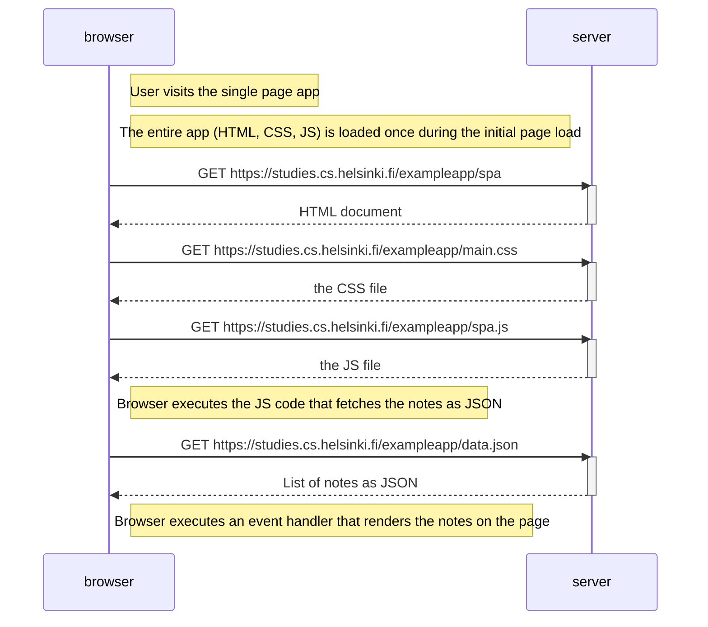

```mermaid

sequenceDiagram
    participant browser
    participant server

    Note right of browser: User visits the single page app

    Note right of browser: The entire app (HTML, CSS, JS) is loaded once during the initial page load

    browser->>server: GET https://studies.cs.helsinki.fi/exampleapp/spa
    activate server
    server-->>browser: HTML document
    deactivate server

    browser->>server: GET https://studies.cs.helsinki.fi/exampleapp/main.css
    activate server
    server-->>browser: the CSS file
    deactivate server

    browser->>server: GET https://studies.cs.helsinki.fi/exampleapp/spa.js
    activate server
    server-->>browser: the JS file
    deactivate server

    Note right of browser: Browser executes the JS code that fetches the notes as JSON

    browser->>server: GET https://studies.cs.helsinki.fi/exampleapp/data.json
    activate server
    server-->>browser: List of notes as JSON
    deactivate server

    Note right of browser: Browser executes an event handler that renders the notes on the page

```