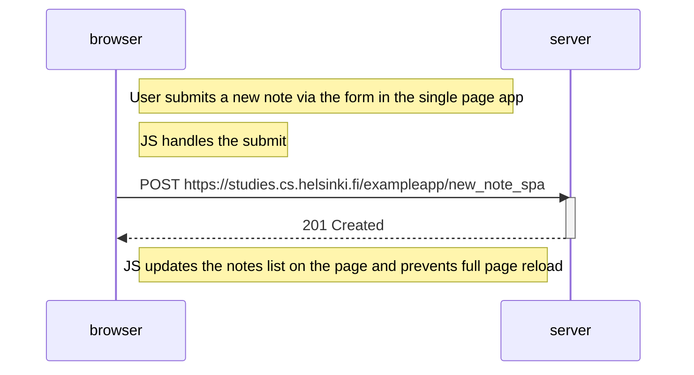

```mermaid

sequenceDiagram
    participant browser
    participant server

    Note right of browser: User submits a new note via the form in the single page app

    Note right of browser: JS handles the submit

    browser->>server: POST https://studies.cs.helsinki.fi/exampleapp/new_note_spa
    activate server
    server-->>browser: 201 Created
    deactivate server

    Note right of browser: JS updates the notes list on the page and prevents full page reload

```