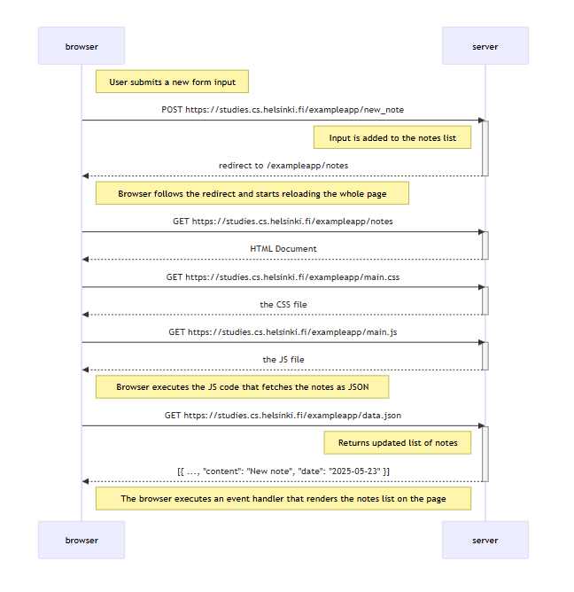
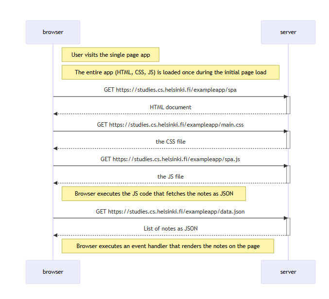
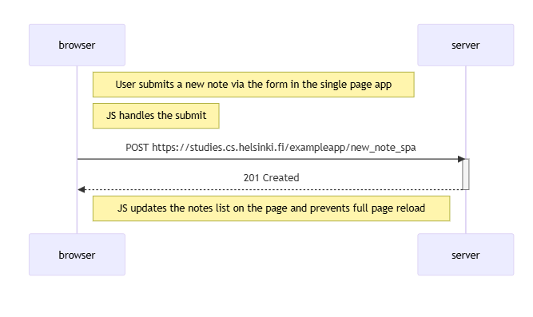

# Part 0: Fundamentals of Web Development

Part 0 explains how web applications work behind the scenes. It covers the structure of web applications, browser–server communication, and the basics of HTTP.

The exercises involved creating diagrams to demonstrate how web apps function:

## 0.4 - New note diagram

## 0.5 - Single-page app diagram

## 0.6 - New note in single-page app diagram
