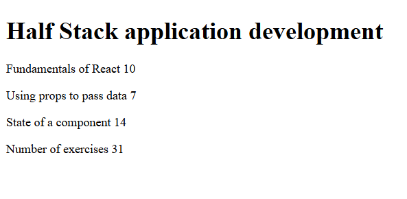
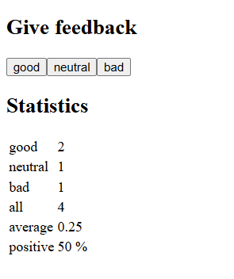
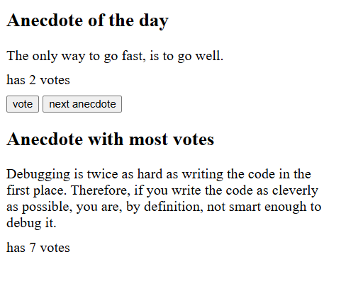

# Part 1: Introduction to React

Part 1 covers the fundamentals of React, like creating components, passing props, and managing state with hooks. It includes three exercises:

## 1. Courseinfo

## 2. Unicafe

## 3. Anecdotes

## Running the applications
Assuming you have already cloned the repository:

1. Navigate to the project you want to run, for example `cd part1/anecdotes`
2. Install dependencies: `npm install`
3. Start the application: `npm run dev`

The app should be available at http://localhost:5173/
