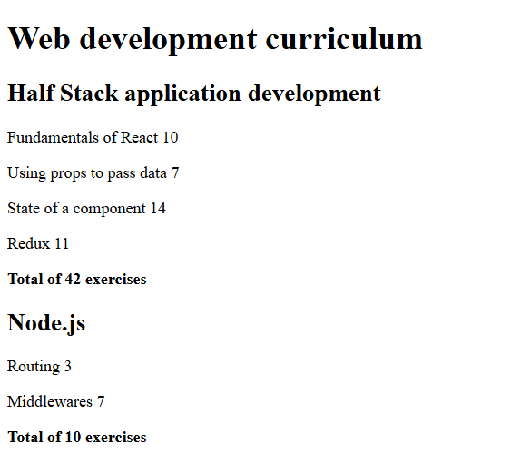
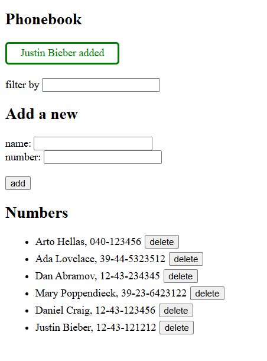
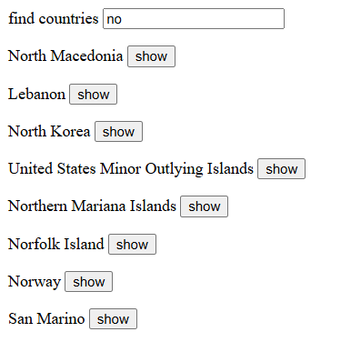
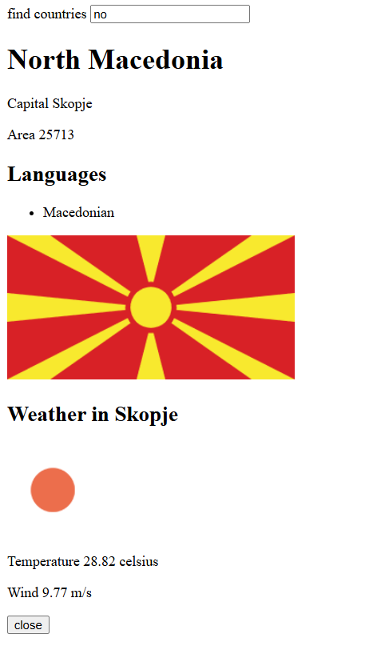

# Part 2: Communicating with server

Part 2 continues with React basics, focusing on topics like list rendering, modular components, state management with `useState` and `useEffect`, form handling and user input, styling a React app, and communicating with a server using Axios.

The exercises:
## Courseinfo

- Creating reusable components
- Rendering lists dynamically with `map`
- Calculating using `reduce`

## Phonebook

- Managing form inputs and state
- Communicating with server using `Axios` (GET, POST, PUT, DELETE)
- Filtering contacts based on user input
- Displaying notifications for successful actions or errors
- Adding CSS styling to a React app

Note! When running the Phonebook app, remember to start the backend server by running:
```npm run server```

## Countries



- Fetching data from public APIs:
    - Rest Countries
    - OpenWeatherMap
- Filtering countries based on user input
- Conditional rendering of search results
- Displaying country details either when the “show” button is clicked, or when the search returns a single result

Note! When running the Countries app, you need your own OpenWeatherMap API key. Create a `.env` file in the project root with the following line:
```VITE_API_KEY=your_key```


## Running the applications

1. Install dependencies: `npm install`
2. Start the application: `npm run dev`

(For Phonebook, you also need to start the server: `npm run server`)

The app should be available at http://localhost:5173/