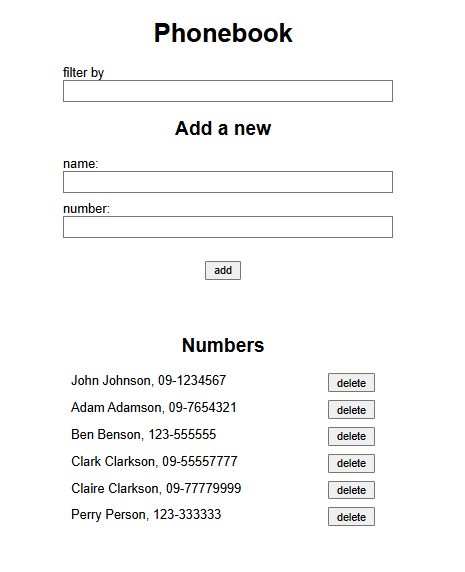

# Part 3: Programming a server with NodeJS and Express

Part 3 explores backend development and covers topics such as Node.js, Express, RESTful APIs, MongoDB and Mongoose, data validation, and ESLint.

The exercises focus on developing the backend for the Phonebook application, integrating it with the frontend created in Part 2, and deploying the complete application online.

The app is live on Render: [https://fullstackopen-phonebook-m9lk.onrender.com/](https://fullstackopen-phonebook-m9lk.onrender.com/)



## Running the application

Running the app locally requires setting up your own MongoDB project, which involves some extra work. If you would like to try, you can read the course instructions here: [https://fullstackopen.com/en/part3/saving_data_to_mongo_db#mongo-db](https://fullstackopen.com/en/part3/saving_data_to_mongo_db#mongo-db)

Then, assuming you have cloned the repository, navigate to the project directory `part3/phonebook`.

1. Create a `.env` file in the project root, and add your MongoDB connection string and port number like this:
    ```
    MONGODB_URI=your_connection_string
    PORT=3001
    ```
2. Install dependencies:
    ```
    npm install
    ```
3. Start the application:
    ```
    npm run dev
    ```

The app will be available at http://localhost:3001
